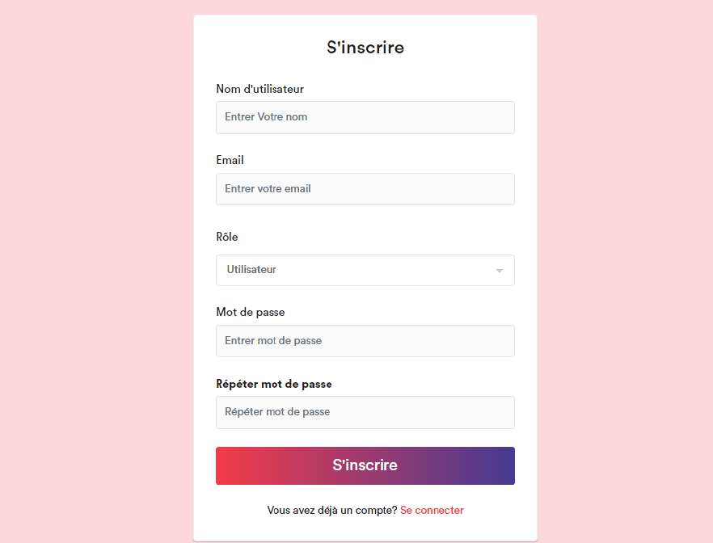
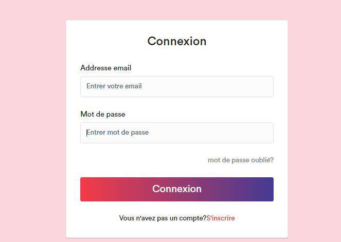
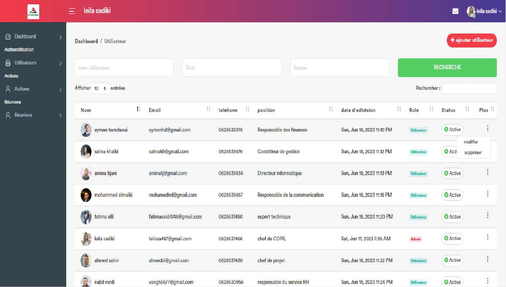
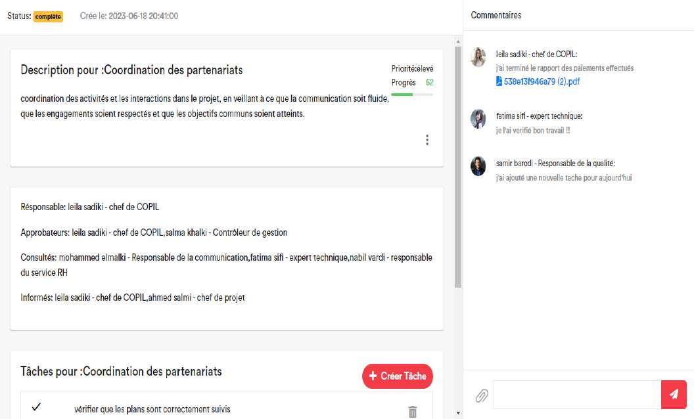

# 📊 Application de suivi des actions du comité de pilotage

Ce projet a été réalisé dans le cadre de mon **stage de fin d'études** au sein du groupe **Al Omrane** à Oujda.MAROC. Il s'agit d'une **application web de gestion et de suivi des actions** issues des réunions du comité de pilotage (COPIL), avec une traçabilité complète, des fonctionnalités collaboratives et un espace utilisateur sécurisé.

---

## 🚀 Fonctionnalités principales

🔐 **Authentification sécurisée** : Inscription, connexion, réinitialisation de mot de passe.  
👥 **Gestion des utilisateurs** : Ajout, modification, suppression, historique d’activité.  
📆 **Réunions** : Consultation, ajout et suppression (admin).  
✅ **Actions** : Création, édition, suppression, statut, priorité, assignation via matrice **RACI**.  
📝 **Commentaires et tâches** : Pour chaque action, avec gestion des pièces jointes.  
📄 **Rapports** : Export PDF, Excel, CSV, impression.  
📨 **Envoi de courriels** : Formulaire intégré pour communiquer entre utilisateurs.  
👤 **Profil utilisateur** : Vue détaillée + actions/réunions liées.

---

## 🧠 Objectifs du projet

- Appliquer les compétences acquises en développement web full stack.
- Améliorer la coordination entre les membres du comité.
- Optimiser la gestion des actions avec traçabilité et responsabilités claires.
- Offrir une interface intuitive pour l’ensemble des utilisateurs.

---

## 🧰 Technologies utilisées

- **Frontend** : HTML, CSS, JavaScript, Bootstrap, jQuery
- **Backend** : PHP avec le framework **Laravel**
- **Base de données** : MySQL
- **Outils** : VS Code, Git, XAMPP, Lucidchart

---

## 📸 Aperçu de l'application

### 🔐 Authentification

### 🏠 Tableau de bord

### 👥 Gestion des utilisateurs

### 📅 Réunions

### ✅ Actions

### 📊 Rapport des actions

### 📤 Envoi d’e-mails

### 👤 Profil utilisateur

> 📁 Toutes les images sont à placer dans un dossier `/images` à la racine du projet.

---

> ✨ Ce projet m’a permis de mettre en œuvre mes compétences en développement full stack tout en contribuant à la modernisation des outils internes d’un organisme public.

---

## 📃 Licence

Ce projet est privé dans le cadre d’un stage académique et n’est pas destiné à un usage commercial ou public sans autorisation.

